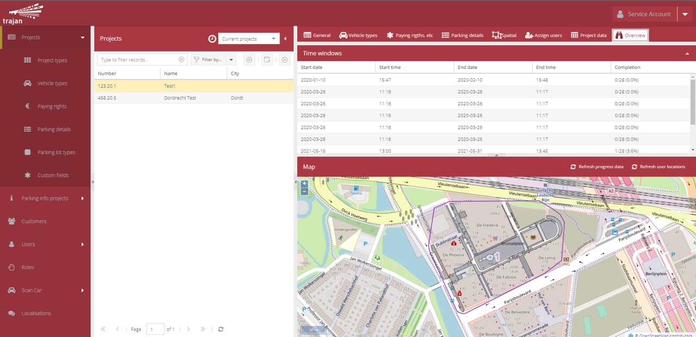
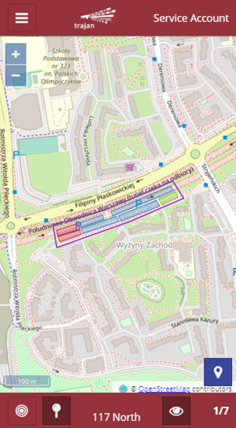
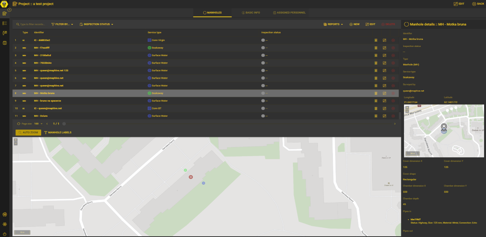
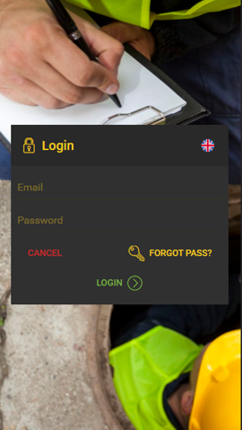
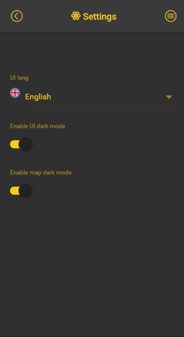
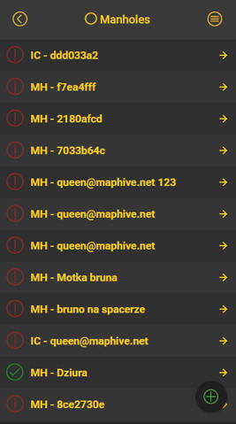
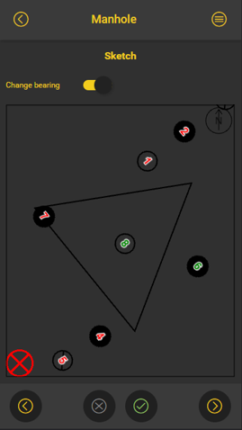

# extjs-examples-blank-mh-project
A basic empty ExtJs mh project

mh (MapHive) provides some app building abstractions over ExtJs - it streamlines app initialisation procedure and provides some common utils, such as routing, localization, basic dataview with record & edit view, map panel, etc.

mh uses its own backend written in .net core 3.1 (that will be ported to .net 5+ at some point...); out of the box backend provides user management, authorizataion, a standardised data endpoints and more; it uses pgsql as a data store.

currently clientside mh compiles agains ExtJs 7.5, although some older branches, such as maphive1 will work with older ExtJs verssions (7.4 and potentially some older 7.x realeses);

mh started as a set of utils for ExtJs classic toolkit but now focuses on ExtJs modern.

this example does not require mh backend

In order to set it up you need to include some dependacies in the packages local directory (either clone the repos there or simply link them via symlinks):
* mh - https://github.com/cartomatic/MapHive.ExtJs
* icon-54 - https://github.com/cartomatic/ExtJs.Icon54
* icon-54-com - https://github.com/cartomatic/ExtJs.Icon54com
* linear-icons - https://github.com/cartomatic/ExtJs.LinearIcons

mh is a work in progress project so bear in mind it will change with time.

Since mh is a framework we use when creating apps for our customers, there are no publically accessible examples so far :(
We can share a couple of screenshots though ;)

